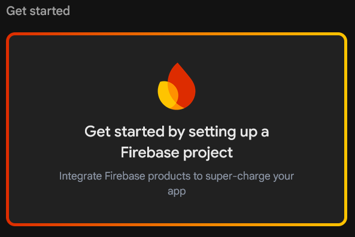
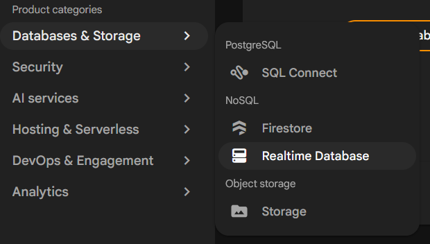
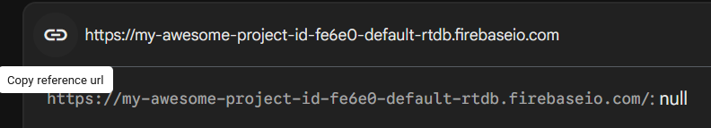
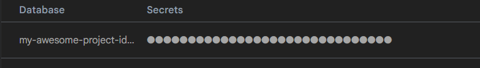

# How to link Hive Mind to a Database

For this setup guide I'm going to use Firebase because
it's free and easy to setup, but other databases should be easy to setup aswell. 

## 1. Create a project
Go to [Firebase](https://console.firebase.google.com/) and in the Firebase console you will see a button that says get started. Click that and go through the process of settings it up.



## 2. Database Setup
Once you created your Firebase project on the left sidebar you will see a dropdown for Databases & Storage and under that click Realtime Database.



Create a database. When it's done, copy your url.



## 3. Integration
When done with copying your url, you also have to copy your key. Your key can be found in the Settings > Service Accounts > Database Secrets.



Now you install Hive Mind API (refer to [installation](README.md#installation)) use this example code
```ts
import { system, world } from "@minecraft/server";
import { HivemindAPI } from "./api";

const api = new HivemindAPI("<Your Name / Mod>", { scriptEvent: true });

world.afterEvents.playerSpawn.subscribe(async ({ initialSpawn, player }) => {
    await api.sendHttpRequest(`Your-Firebase-Link/(path to save it to)/(name of thing.json)?auth=(your key)`, {
        method: "PUT",
        body: JSON.stringify({
            //Data you want to save on the json
        })
    })

    // Default request type is get
    const getReq = await api.sendHttpRequest(`Your-Firebase-Link/(path to save it to)/(name of thing.json)?auth=(your key)`)

    getReq.getData();
})
```
Or a real example:

```ts
import { system, world } from "@minecraft/server";
import { HivemindAPI } from "./api";

const api = new HivemindAPI("<Your Name / Mod>", { scriptEvent: true });
world.afterEvents.playerSpawn.subscribe(async ({ initialSpawn, player }) => {
    if (initialSpawn) {
        await api.sendHttpRequest(`https://my-awesome-project-id-fe6e0-default-rtdb.firebaseio.com/players/${player.name}.json?auth=${key}`, {
            method: "PUT",
            body: JSON.stringify({
                //Data you want to save on the json
                gamemode: player.getGameMode(),
                level: player.level
            })
        })

        // Default request type is get
        const getReq = await api.sendHttpRequest(`https://my-awesome-project-id-fe6e0-default-rtdb.firebaseio.com/players/${player.name}.json?auth=${key}`)

        getReq.getData();
    }
})
```

# WARNING
If you intend to post / share the mod. Please encrypt / obfuscate your key otherwise the downloader will be able to see it.