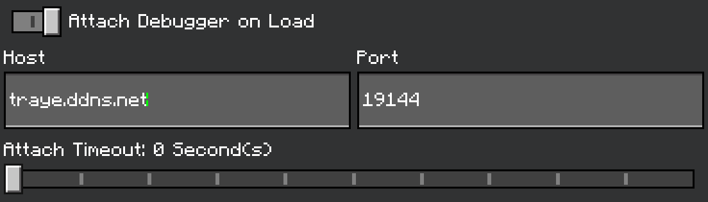

# Hive Mind API

You can use this for getting server-net on worlds.

It has post requests, get requests, put requests and everything you can do with `fetch()`.

This is made all possible because of the [debugger server](https://github.com/TrayePlays/Hive-Mind-Debugger) back-end.

There are options to set like using script events, and logging failures.

# WARNING
If you intend to post / share the mod. Please encrypt / obfuscate your key otherwise the downloader will be able to see it.

# Installation

### For TypeScript
Install the [api.ts](https://github.com/TrayePlays/Hive-Mind-Api-Public/blob/main/src/api.ts) and put it in your project.

### For JavaScript
Install both [api.js](https://github.com/TrayePlays/Hive-Mind-Api-Public/blob/main/js/api.js) and [api.d.ts](https://github.com/TrayePlays/Hive-Mind-Api-Public/blob/main/js/api.d.ts) and put them in your project

# Connecting

You are first going to need to connect to Hive Mind.
There are 2 ways:

## 1. Automatically:
- ### Open your settings > creator and put this in


## 2. Manually: 
- ### When in game type:


# Usage

### For a simple GET request use this:
```ts
import { system, world } from "@minecraft/server";
import { HivemindAPI } from "./api";

const api = new HivemindAPI("<Your Mod / Name>", { scriptEvent: false });

world.afterEvents.itemUse.subscribe(async ({ itemStack }) => {
    if (itemStack.typeId == "minecraft:diamond") {
        const now = system.currentTick;
        const num = Math.floor(Math.random() * 100) + 1;

        // This website returns random quotes using a ID up to 100
        const uri = `https://dummyjson.com/quotes/${num}`;
        world.sendMessage(`§aFetching ${uri}`);

        const reqData = await api.sendHttpRequest(uri);

        // For getting the stringified version use .data
        world.sendMessage(`§bRaw Data: ${reqData.data}`);

        // For getting data off of it use .getData
        world.sendMessage(`§eAuthor: ${reqData.getData().author}`);
        world.sendMessage(`§dResponse Time: ${(system.currentTick - now) / 20}`);
    }
})
```

### For a simple POST request use this:
```ts
import { system, world } from "@minecraft/server";
import { HivemindAPI } from "./api";

const api = new HivemindAPI("<Your Mod / Name>", { scriptEvent: false });

world.afterEvents.itemUse.subscribe(async ({ itemStack }) => {
    if (itemStack.typeId == "minecraft:gold_ingot") {
        const uri = `https://jsonplaceholder.typicode.com/posts`

        // Sending a post request to this example website
        const postData = await api.sendHttpRequest(uri, {
            method: "POST",
            headers: {
                "Content-Type": "application/json"
            },
            body: JSON.stringify({
                title: 'Hello',
                body: 'World',
                userId: 1,
            }),
        })

        world.sendMessage(`§9Post Result: ${postData.data}`);

        // Website creates a new ID for each post
        world.sendMessage(`§6Id: ${postData.getData().id}`)
    }
})
```

# Database Setup
If you want to use Hive Mind API for a database refer to [this page](DATABASE.md)

# Need help? 
- ### [Join the discord!](https://discord.gg/GHzNqpZ4Bu)